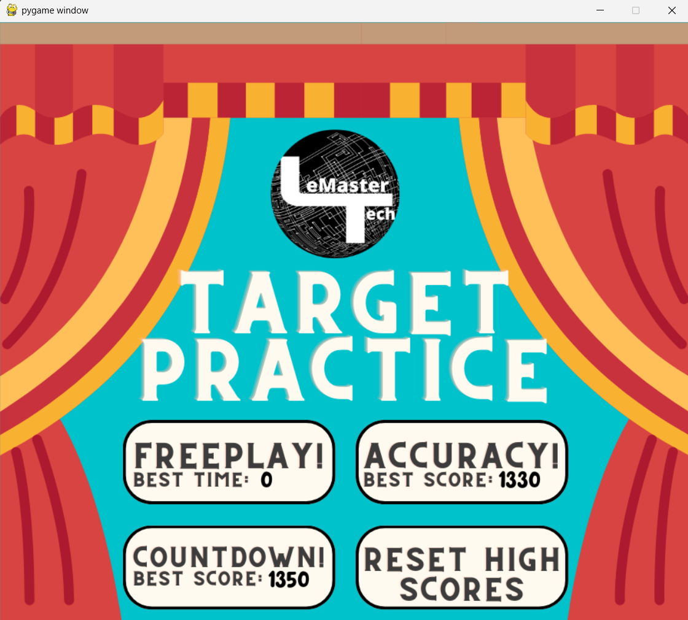
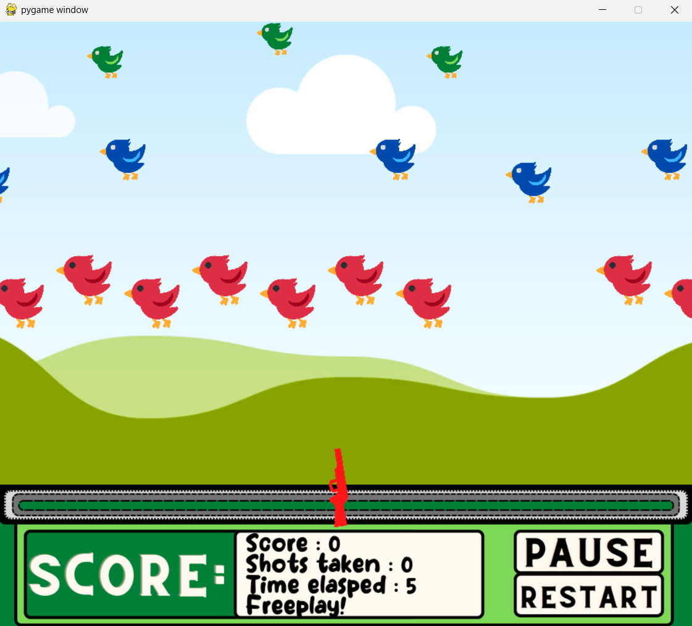

# 🔫 Arcarde Shooter Game

A fully interactive shooting game built using **Python** and **Pygame**, built with [FreeCodeCamp's Python & PyGame Tutorial](https://www.youtube.com/watch?v=T2pd3KRSoHI).

## 🎮 Game Modes

The game includes 3 different gameplay modes with level progression and scoring:

1. **Freeplay Mode**

   - Unlimited shots
   - Your score is the time taken to complete all levels

2. **Accuracy Mode**

   - Limited ammo (81 shots)
   - Score is based on hits before ammo runs out

3. **Timed Mode**

   - 30 seconds to shoot as many targets as possible

---

## 🧠 Game Mechanics

- **Multiple levels** with increasing difficulty and enemy types
- **Rotating gun** that follows the mouse cursor
- **Animated enemies** with different speeds and hitboxes
- **Sound effects** based on the type of target hit
- **Pause**, **reset**, and **high score tracking** using `highScores.txt`

---

## ▶️ How to Run

### 1. Install Requirements

```bash
pip install pygame
```

### 2. Run the Game

```bash
python main.py
```

---

## 💾 Save System

- The game automatically updates `highScores.txt` with the best score for each mode.
- You can reset scores directly from the in-game menu.

---

## 📌 Requirements

- Python 3.x
- Pygame
- OS: Windows / macOS / Linux

---

## 📸 Preview





## 📚 Credits

Created while following the [Python & PyGame Tutorial](https://www.youtube.com/watch?v=T2pd3KRSoHI) by FreeCodeCamp. Some files used in this project are also sourced from the same tutorial.
